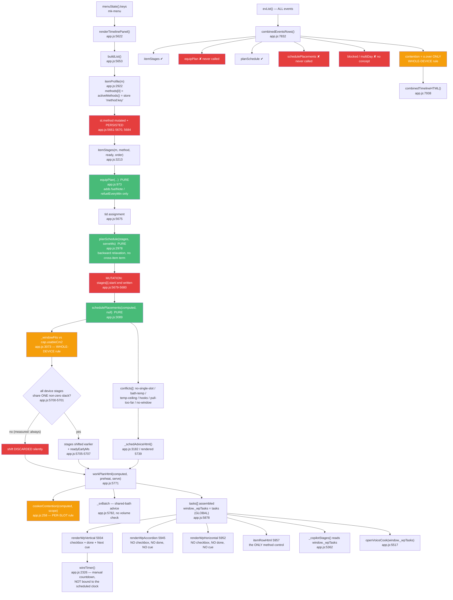

# W1-G — Workplan & Workflows, as BUILT

Agent W1-G · discovery sweep · 2026-07-22
Scope: the core loop — menu → stages → equipment → schedule → placement → tasks → render → timers → copilot → voice.
Method: read `app.js` (9,564 lines), then verified every load-bearing claim at runtime in Chromium against the
built artifact (`python build.py` → `dist/index.html`, served by `serve.js` on :8123).

**No source file was modified.** All runtime probing was done by driving the page and its own `localStorage`.

---

## 0. Verification status of the three "known context" items

| Claim given to me | Verdict | Evidence |
|---|---|---|
| `equipPlan` enriches only the single-event plan; the multi-event view never calls it | **CONFIRMED** | `equipPlan(` has exactly two occurrences in `app.js`: the definition (973) and the single call site (5673). `combinedEventsRows` (7832) calls `itemStages` + `planSchedule` only. |
| `choosePlate`/`chooseNozzle` exist with zero production callers | **CONFIRMED, and worse** | Each name appears **exactly once** in `dist/index.html` — the definition. But both are *unit-tested* in `tests/equip-chooser.spec.ts:51,64`, so they show up as covered. `chooseBath` is the sibling that *does* have a caller (`app.js:630`). |
| The Phase 3a solver (`orchestrate`/`movesForClash`/`applyMove`) does not exist | **CONFIRMED** | 0 occurrences in `dist/index.html`; at runtime all three are `typeof === "undefined"`. |

---

## 1. Flow map of the real code path



### Anchors

| Step | Function | Anchor |
|---|---|---|
| Menu → items | `renderTimelinePanel` / `buildList` | `app.js:5622`, `app.js:5653` |
| Profile + method resolution | `itemProfile` → `activeMethods` | `app.js:2922`, `app.js:832` |
| Stage generation | `itemStages` | `app.js:3213` |
| Equipment seam (pure) | `equipPlan`, `DEVICE_FUEL`, `REFUEL_MIN` | `app.js:973`, `964`, `957` |
| Backward relaxation (pure) | `planSchedule` | `app.js:2978` |
| Times written onto stages | (caller mutation) | `app.js:5679-5680` |
| Capacity placement (pure) | `schedulePlacements`, `_windowFits`, `SCHED_PULL_MAX_MS` | `app.js:3089`, `3073`, `3065` |
| Shift apply / discard | (caller) | `app.js:5696-5711` |
| Safety invariant | `safetyDiff` | `app.js:3039`, checked `5712-5720` |
| Advisory | `_schedAdviceHtml` | `app.js:3182`, rendered `5739` |
| Clash banner | `cookerContention` | `app.js:258`, called `5777` |
| Task assembly | `workPlanHtml` | `app.js:5771`, `window._wpTasks` `5878` |
| Three shapes | vertical / accordion / horizontal | `app.js:5934` / `5945` / `5952` |
| Items view | `itemRowHtml` | `app.js:5957` |
| Timers | `timerHTML`, `wireTimer` | `app.js:2279`, `2326` |
| Plan start / feasibility | `renderPlanStartRow` | `app.js:5586` |
| Live copilot | `startLiveCook`, `_copilotStages`, `copilotPace` | `app.js:5351`, `5362`, `5395` |
| Voice cook | `openVoiceCook` | `app.js:5517` |
| Multi-event | `combinedEventsRows`, `combinedTimelineHTML` | `app.js:7832`, `7938` |

---

## 2. Every place two views can disagree about the same fact

### 2.1 Three different capacity rules for one device — MEASURED

Same device, same instant, same items. The three consumers each apply a different test:

| Consumer | Rule | Anchor |
|---|---|---|
| `schedulePlacements` (placement + advisory) | `_windowFits` vs **whole-device** `cap.usableCm2` | `app.js:3073`, `3155` |
| `cookerContention` (single-event clash banner) | `o.fit.verdict==='over' \|\| o.over` — **per-slot** honest verdict | `app.js:277-281` |
| `combinedEventsRows` (multi-event view) | `o.over \|\| !o.compat.tempOk` — **whole-device only** | `app.js:7882` |

Runtime measurement (5-rack cabinet, 6000 cm²; brisket 1320 cm² + short ribs 600 cm² co-smoking):

```
at 12:30 on eq-smoker1, 2 items [cut-1:1320, cut-2:600]
  perSlotCm2 1020 · usableCm2 5100 · pct 38 · o.over false · fit.verdict "over" · slotOver true
  combinedEventsRows rule  -> false   (no warning in the multi-event view)
  cookerContention rule    -> true    (⚠ Cooker clash in the single-event view)
```

The comment at `app.js:277-281` names this exact bug ("the exact lie H4 removed, still alive in this second
code path") — the fix landed in `cookerContention` and **not** in `combinedEventsRows`.

### 2.2 Serve time — three surfaces, two of them on the SAME screen — MEASURED

`mk-tlserve` is a single **global** key (`app.js:5545`), not per-event. Editing the serve input writes it
(`app.js:5637`) but never writes back to `ev.serve`; only an explicit `evSaveCurrent()` (`app.js:7759`) syncs it.

Real `input` event dispatched on `#tlServe`, changing 19:00 → 22:30:

| Surface | Reads | Showed |
|---|---|---|
| Serve input + serve bar + entire plan | `serveDateTime()` → `mk-tlserve` | **22:30** |
| Event identity banner, directly above it | `ev.serve` (`app.js:5617`) | **19:00** |
| Combined multi-event timeline | `parseServeTime(ev.serve, ev)` (`app.js:7834`) | **19:00**, every start time 3.5 h wrong |

Screenshot: `docs/analysis/shots/w1g-serve-divergence.png` — the banner reads `הגשה 19:00` while the input
directly beneath reads `22:30` and the serve bar reads `עוד 13ש 40 דק׳ … 22:30`.

The serve **date** diverges the same way in reverse: the date picker writes `mk-tlservedate-<scope>`
(`app.js:5532`, `5638`), which the combined view never reads — it uses `ev.date` only.

### 2.3 Multi-day items: excluded in one view, scheduled in the other — MEASURED

`buildList` computes `blocked = profile.multiDay && !st.ready` (`app.js:5668`) and drops the item from the
timed plan, surfacing it as a prep-ahead advisory (`app.js:5890`). `combinedEventsRows` has **no `blocked`
concept at all**.

With a dry-cured Soppressata (`make-m-sopr`, `multiDay:true`) marked "from scratch":

```
single-event plan  : 0 rows. Advisory — "📋 הכנה מראש (רב-יומי): סופרסטה — תהליך של ימים-שבועות
                     (כבישה/ייבוש) … לא נכלל בלוח היומי."   ("not included in the daily schedule")
combined view      : a normal scheduled row, start 18:51 local, totalH 0.15
```

The combined view tells the cook to start a weeks-long dry-cured salami nine minutes before serving.

### 2.4 The three plan shapes disagree about what is done — MEASURED

The same 15 tasks, rendered three ways:

| Shape | Cells | Checkboxes | `wp-done` markers | "Next" cue |
|---|---|---|---|---|
| Vertical (`5934`) | 15 | 15 | **2** | yes |
| Accordion (`5945`) | 15 | **0** | **0** | **0** |
| Horizontal (`5952`) | 15 | **0** | **0** | **0** |

Only `renderWpVertical` emits `.wp-ck` and reads `store.get('wpck:…')`. A cook who prefers the accordion
cannot tick anything off, and cannot see what they already did. The state is still in storage — it is simply
invisible in two of the three shapes.

### 2.5 Method: the card and the plan disagree — MEASURED with a real click

`methodToggleHTML` (`app.js:1010`) renders the ⚡ toggles under the hint
**"שיטות פעילות — התוכנית מתעדכנת"** ("Active methods — the plan updates"), and
`renderTimelinePanel` says the method **"נלקחת מהמתגים בכרטיסייה (⚡)"** ("is taken from the switches on the card").

The handler writes to `cardSess` — page-lifetime memory — unless inside a project:

```js
app.js:2186   if(curProject) store.set(methodKeyFor(key),next); else cardSet('method:'+key,next);
```

`itemProfile` reads `activeMethods` (`app.js:833`), which reads `store.get('method:'+key)` and never looks at
`cardSess`. Real click on the sous-vide toggle of Brisket (`curProject === null`):

```
DOM after click           : sv:off  smoke:ON  grill:off
cardMethods('cut-1')      : ["smoke"]
activeMethods('cut-1')    : ["sv","smoke"]        <- what itemProfile reads
itemProfile().methods[0]  : "c:smoke_sv"  label "⚡ סו-ויד + עישון (מהכרטיסייה)"
rendered work plan        : 🌊 סו-ויד 68° — בריסקט   <- the 30 h stage just switched off
```

The label literally says "(from the tab)" while showing something the tab does not say. Outside a project the
⚡ toggles are decoration.

### 2.6 The bath advice contradicts the occupancy model — MEASURED

`_svBatch` (`app.js:5782-5787`) takes `Math.max(baths)` and instructs the cook to use it, with **no volume check**.
`deviceOccupancy` (`app.js:485-492`) states in its own comment that with 2+ items the true fill is higher than
it can compute. Three cuts, one 24 L bath:

```
plan row : "🌊 אמבט משותף עם בריסקט · השתמש באמבט 24 ל׳ לכולם"   (use the 24 L bath for all)
model    : cut-1 needs 24 L, cut-2 needs 12 L, cut-11 needs 12 L
           pct 100, pctFloor TRUE (the % is a floor), over FALSE
```

The plan issues a confident instruction the model beneath it says it cannot verify.

### 2.7 Advisory vs clash banner: same load, different verdicts

`_schedAdviceHtml` renders `window._plcConflicts` — computed **before** any shift (`app.js:5692`).
`cookerContention` is computed **after** (`app.js:5777`). They use different rules (§2.1), so a `bath-temp`
conflict appears in the advisory while the clash banner is silent, and a per-slot overflow appears in the
clash banner while the advisory is silent. Observed together in one render: `conflicts:[bath-temp, no-single-slot]`.

### 2.8 The combined view labels every clash "Smoker overlap"

`combinedTimelineHTML` hardcodes the warning as `⚠ מעשנה` / `Smoker` and the note as
*"One smoker will not be enough — stagger the serve times or use two smokers"* (`app.js:7947`, `7950`) —
regardless of whether the contended device is a sous-vide circulator or an oven.

---

## 3. State: mutated vs derived

### Genuinely pure (verified by reading, all return fresh objects)

| Function | Anchor | Note |
|---|---|---|
| `equipPlan` | `973-985` | `Object.assign({}, s)`; complete no-op when no kit configured |
| `planSchedule` | `2978-2991` | returns `{stages, startMs}`; never touches the input |
| `schedulePlacements` | `3089-3180` | mutates only its own `rec` objects |
| `safetyDiff` | `3039` | comparison only |
| `chooseBath`/`choosePlate`/`chooseNozzle` | `3004`/`3014`/`3024` | pure; two of three unused |

The header comment on `planSchedule` (`app.js:2976-2977`) states the design intent explicitly:
*"Pure: it returns placements and never writes onto the generator's output, so two candidate schedules can
coexist — the prerequisite for comparing alternatives at all."*

### Mutated — and where it kills the second candidate

1. **The scheduler's purity is discarded by its own caller.** `planSchedule` returns placements; `buildList`
   immediately writes them onto the stage objects (`app.js:5679-5680`), and the placement pull writes over the
   same fields again (`app.js:5705-5707`). `computed` is the only representation of a plan in memory, and
   there is exactly one of it. The prerequisite the comment describes is established at 2978 and destroyed at 5679.

2. **Rendering the plan writes user state to storage.** `st` *is* `allState[m.key]`; `buildList` assigns
   `st.method`, `st.svSmokeOrder`, `st.stage`, `st.ready` (`app.js:5661-5670`) and then persists the whole map
   with `tlSetState(allState)` (`app.js:5684`). Merely *looking* at the plan commits a method choice. Evaluating
   "what would sv-only cost me?" cannot be done without writing that choice to `mk-tlstate-<scope>`.

3. **Window-global singletons, one per app, in an app that models parallel events.**
   `window._wpTasks` (`5878`), `_wpCtx` (`5775`), `_plcConflicts` (`5692`), `_wpServe`/`_wpStart` (`5758`),
   `_planSafetyViolations` (`5712`). Per-event state (`mk-timers`, `mk-cook-live-<scope>`, `mk-tlstate-<scope>`,
   `mk-plan-started-<scope>`) is correctly scoped in *storage* but collapses to one slot in *memory*.

4. **`cardSess`** (`app.js:843`) is a page-lifetime object keyed by item key only — not by event scope. A card's
   scratch method state is shared across every event.

**Measured consequence of #3:** with a live cook session open on Event A, opening Event B's timeline
re-pointed the copilot at B's tasks while A's session was still live:

```
liveSessions          : ev-A live:true, ev-B live:false
_wpTasks length       : 12  (A)  ->  9  (after opening B)
_copilotStages().cur  : "🌊 סו-ויד 68° — בריסקט"  ->  "🌶️ שפשף ראב — פרגיות"
```

---

## 4. What a user can and cannot influence

### Can

| Control | Anchor | Effect |
|---|---|---|
| Serve time | `5637` | whole plan re-relaxes backward (but see §2.2) |
| Serve date | `5638` | per-scope only; combined view ignores it |
| Ready / from-scratch per item | `itemRowHtml` `5957` | adds build phases, or blocks multi-day items |
| **Method per item — timeline dropdown** | `6042-6043` | the only working method control; sets `methodPinned` |
| sv↔smoke order | `data-tlorder` | only when `comboHasSvSmoke` (cited data) `3263` |
| Cooker assignment per item+kind | `data-tlcooker`, `5891-5898` | only when ≥2 candidates |
| Plan start / strict block / push +30 / reschedule-from-now | `5586-5604` | feasibility gate |
| View mode, shape, detail level | `5766-5768` | presentation only |
| Equipment registry (area, racks, maxC, baths, hooks) | `EQUIP_CATS` `34` | drives every capacity check |

### Cannot

- **Stage durations.** They come from the data (`svh`/`smh` via `upperHours`, `app.js:6`). Nothing in the UI
  edits a duration — correct as a safety stance, but there is no "I know this brisket runs fast" affordance.
- **The card's ⚡ toggles** — outside a project they do not reach the plan at all (§2.5).
- **Method from the work-plan view.** `methodOpts` lives in `itemRowHtml` (`5971`), which only renders in the
  *items* view. The plan view exposes cook-order and cooker strips but no method control.
- **Which shelf an item goes on** — `packDevice` assigns; no override.
- **The 2 h pull bound** (`SCHED_PULL_MAX_MS`, `3065`) — no UI, no explanation of the number.
- **Batching / rounds.** The advisory says *"cook in batches"* (`3195`, `3199`) but no batch feature exists.
- **Rest reservation in the copilot verdict** — see §5.6.
- **Preheat minutes** — derived from `_preheatRow()` (`952`), not user-set.

---

## 5. The eight gaps a cook would notice

### 5.1 The capacity placer never actually places anything — MEASURED

`schedulePlacements` tests fit against **whole-device** `usableCm2` (`3073`, `3155`), while the binding
constraint in reality is the **per-shelf** limit — which the placer only ever uses to *reject*
(`no-single-slot`, `3145`), never to search. Its candidate set is `[latestFinish] ∪ {other items' start times}`
(`3149-3151`), so a pull is either 0 or a jump to another item's start — usually far past the 2 h bound.

Swept 22 realistic menus (2–6 items, card methods and smoke-only, 5-rack 6000 cm² cabinet + 24 L bath):

```
menus with any non-zero slack : 0 / 22
menus with a shift applied    : 0 / 22
conflicts raised              : no-single-slot, bath-temp
```

`readyEarlyMs`, the `⏳ מוכן N לפני ההגשה` chip (`5975-5987`), `SCHED_PULL_MAX_MS`, and the whole Phase 4b
"move it earlier so it fits" story are **inert in practice**. The app never reschedules; it only advises.

### 5.2 …and when it *would* place something, the caller throws it away

`buildList` applies the shift only if every device-bound stage of an item resolved to the **same non-zero**
slack (`app.js:5700-5701`):

```js
const uniq=slacks.filter(function(v,i,a){return a.indexOf(v)===i;});
if(uniq.length!==1 || !uniq[0]) return;    // nothing to shift, or stages want different shifts
```

Any item with a sous-vide stage (volume mode — takes the early-return path at `3129` and *always* keeps
slack 0) plus a pulled smoke stage produces `[0, X]` → discarded. The trailing comment says the case is
"left to the advisory (4c)", but a *successful* placement raises no conflict, so nothing is shown. The plan
silently keeps the over-subscribed relaxation.

### 5.3 The multi-event view is a different, weaker product — MEASURED

`combinedEventsRows` (`7832`) skips `equipPlan`, skips `schedulePlacements`, has no `blocked` concept, and
uses the whole-device contention rule. Net effect for a cook running two events: the combined timeline shows
start times that ignore capacity, no advisories, a weeks-long cure scheduled nine minutes before serve
(§2.3), no per-slot clash warning (§2.1), and stale serve times (§2.2).

### 5.4 The serve time is global; the banner above the plan contradicts the plan — MEASURED

§2.2. Three surfaces, two of them within 100 px of each other, disagreeing by 3.5 hours after one edit.

### 5.5 Two of the three plan shapes cannot be checked off, and language switching wipes the ticks — MEASURED

§2.4 for the shape gap. The persistence key is the **translated label**
(`'wpck:'+sc+':'+tk.label`, `app.js:5938`):

```
keys in he : "wpck:ev-A:🌶️ הכנת ושפשוף ראבים", "wpck:ev-A:🔪 הכנה — אסאדו"
switch to English -> done rows 2 -> 0; keys are now "wpck:ev-A:🌶️ Rubs — mix and apply", …
```

Same key shape also **collides**: every refuel row for one fuel has an identical label, so they share one
checkbox. Stick-burner brisket, real DOM:

```
🪵 הוספת עצים  19:15   key wpck:ev-A:🪵 הוספת עצים
🪵 הוספת עצים  20:00   key wpck:ev-A:🪵 הוספת עצים
🪵 הוספת עצים  20:45   key wpck:ev-A:🪵 הוספת עצים
distinct checkbox keys : 1
```

Ticking the 19:15 split marks all three done — on the one device (`REFUEL_MIN` 45 min, `app.js:958`) where
missing a refuel puts the fire out.

### 5.6 The live copilot reserves no rest time, and follows the wrong event — MEASURED

`copilotPace` computes `readyBy = s.serveTs - (s.restMin||0)*60000` (`app.js:5413`). **`restMin` is never
written.** The session created by `startLiveCook` (`5351`) has exactly `{startedAt, scope, serveTs, probes}`;
`copilotSetTarget` adds `targetC`, `copilotAdjustServe` updates `serveTs`. Runtime: `'restMin' in session === false`.

So the verdict treats "core hits target exactly at serve" as **on pace**, while the plan itself schedules a
1 h rest for brisket (`itemStages`, `app.js:3257`). The copilot will say "on pace" for a finish that leaves
zero time to rest. Compounding it, `_copilotStages` reads the single global `window._wpTasks` (§3, measured).

### 5.7 Timers are stopwatches, not schedule-aware

`timerHTML` bakes in `dur = s.hours*3600` (`app.js:5838`) and `wireTimer` (`2326`) counts down from whenever
the cook presses ▶. Nothing reconciles a timer with the clock time the plan assigned to that stage. Start the
smoke 40 min late and every downstream clock time in the plan stays where it was; only the serve bar and the
`renderPlanStartRow` feasibility warning (`5595`) react, and those key off `earliest` vs `Date.now()`, not off
actual stage progress. `copilotAdjustServe` (`5385`) is the only path that re-anchors the plan — and it writes
the global `mk-tlserve`, taking §2.2 with it.

### 5.8 The equipment seam is empty for most of the equipment

`equipPlan` is the single declared point where equipment facts enter the plan (`app.js:971-972`). Its two
lookup tables are keyed by device type string. Probed every type in `EQUIP_CATS`:

| Category | Types | Get a `fuelNote` | Get a refuel cadence |
|---|---|---|---|
| smoker | 8 | 7 | 3 (offset 45, WSM 90, kettle 60) |
| grill | 5 | **0** | **0** |
| oven | 3 | **0** | **0** |

`ארון / קבינט` (cabinet) — the app's own **default** smoker, and the one seeded in the sample kit — is absent
from `DEVICE_FUEL` (`app.js:964-967`), so it yields nothing. All five grill types (`פחם`, `גז`, `קטל`, …) and
all three oven types are absent too, because both tables use *smoker*-type strings (`קטל (ככלי עישון)` ≠ the
grill type `קטל`). For most registered kit the seam is a no-op, and the plan's cook stages carry no
equipment-specific instruction at all.

---

## 6. Smaller verified notes

- `cookerFor(itemKey, kind, null)` resolves to `evScope()` via `itemCookerScope` (`app.js:240`), so
  `schedulePlacements(computed, null)` at `5691` uses the **correct** scope. I checked this specifically
  because it looked like a scope bug; it is not one.
- The runtime safety invariant (`safetyDiff`, `3039`, checked `5712-5720`) is real, runs on every rebuild, and
  correctly excludes `start`/`end` from comparison. It found no violations in any scenario I ran.
- `deviceCanReach` (`3083`) correctly declines to invent a ceiling when `maxC` is unstated.
- `planSchedule`'s guard `Number(s.hours)||0` (`2984`) is the fix for the NaN-poisoning divergence its own
  comment describes; both call sites now use it.
- `_unresolved` (`app.js:5903-5912`) honestly surfaces items awaiting a cooker pick when two devices of one
  class exist — a real gap that is stated rather than hidden.

---

## 7. Verification log

| Claim | How verified |
|---|---|
| Phase 3a solver absent | `grep` on `dist/index.html` = 0; runtime `typeof === "undefined"` |
| `choosePlate`/`chooseNozzle` uncalled | 1 occurrence each in `dist/index.html`; callers only in `tests/equip-chooser.spec.ts` |
| `equipPlan` single call site | 2 occurrences in `app.js` (def 973, call 5673) |
| Three capacity rules disagree | `deviceOccupancy` evaluated at every load-change mark; both rules computed side by side |
| Serve-time divergence | real `input` event on `#tlServe`; DOM screenshot |
| Multi-day divergence | real `openTimeline()` render + `combinedEventsRows()` on the same event |
| Shape checkbox gap | real `[data-tlshape]` clicks; DOM counts |
| Language wipes ticks | real `setLang('en')` + re-render; DOM counts |
| Refuel key collision | real DOM read of `data-wpck` on a stick-burner plan |
| ⚡ toggle does not reach plan | real click on `.mtoggle[data-mt="sv"]`; DOM + `itemProfile` + rendered plan |
| Placer inert | 22-menu sweep; slack and shift counters |
| `restMin` dead | `Object.keys(liveSession())` after `startLiveCook` |
| `_wpTasks` bleed | live session on A, `evLoad('ev-B')`, `_copilotStages()` |
| `equipPlan` type coverage | probed all 16 `EQUIP_CATS` types |

Environment: `dist/index.html` built at audit time (2,270,442 bytes), served by `serve.js` on :8123,
Chromium via Playwright MCP. Test state was written into the page's own `localStorage`; no file was edited.
