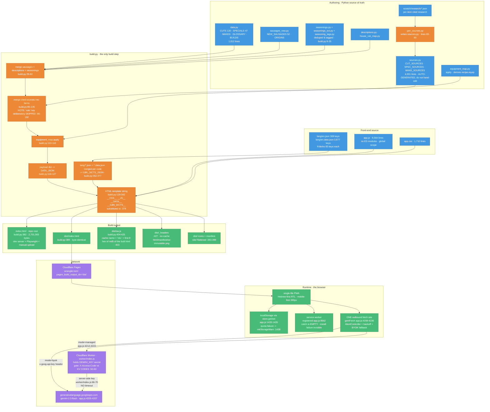
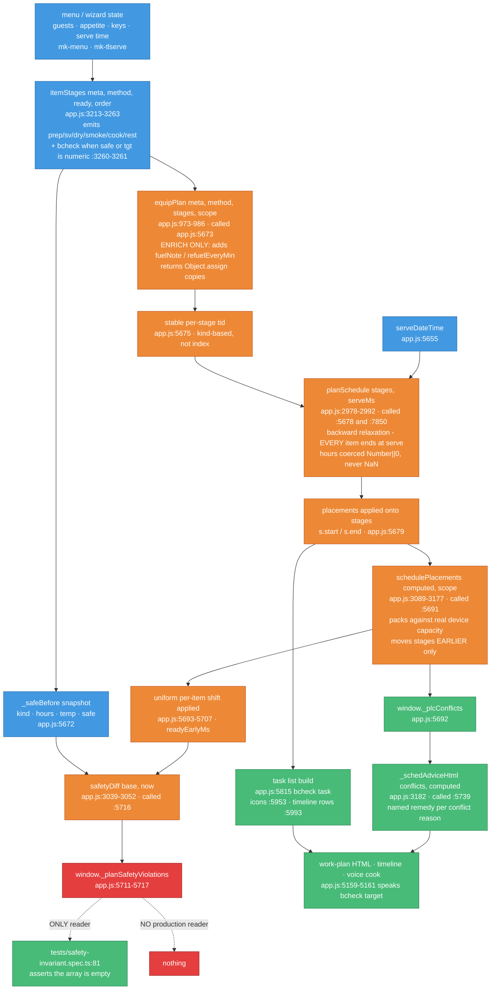
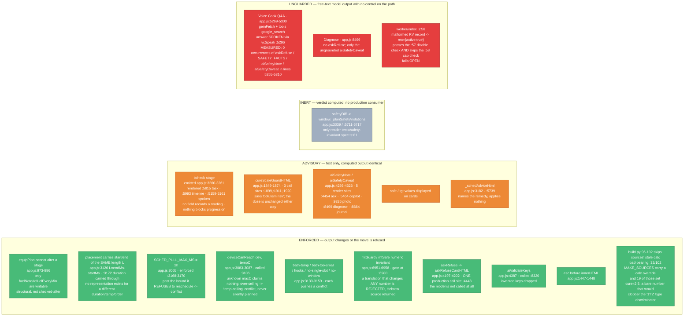
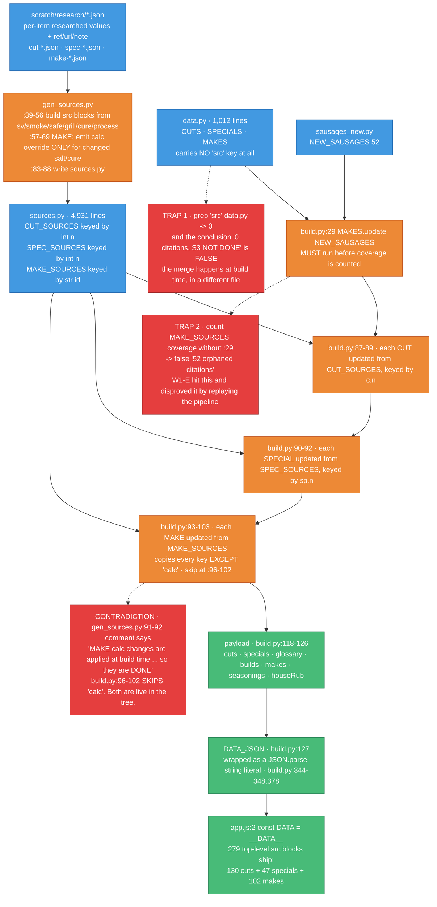

# W5-E · The system in four diagrams

**Date:** 2026-07-22 · **Version:** v258 (`build.py:334` footer stamp) · **Scope:** `app.js` (9,564 lines),
`build.py` (430), `worker/index.js` (91), `sources.py` (4,931), `data.py` (1,012), `app.css` (1,710).

**Method.** Every box, arrow and label below was read out of the current files, not carried over from a prior
report. Each node carries the `file:line` it was drawn from, so a reader can falsify any edge in one `grep`.
Where a diagram asserts an *absence* (no consumer, no guard), the absence was measured — the measuring
command is printed beside it. Numbers restated from Wave 1 reports were re-measured here; where my
measurement differs from theirs, mine is shown and the difference is named.

---

## (a) System architecture — one file, built by Python, served by Cloudflare

**What the picture makes visible**

- There is exactly **one** build step and exactly **one** outbound network call site. Both are chokepoints,
  which is why both are worth guarding hard.
- `index.html` and `dist/index.html` are written from the same `html` string (`build.py:378,382,389`) and are
  byte-identical on disk today (2,701,065 bytes each, measured). **Tests read the root copy; Pages serves
  `dist/`.** They can only diverge if someone edits one by hand.
- The service-worker cache name is derived from the content hash of the built HTML (`build.py:403`), so every
  build invalidates cleanly — the mechanism behind "v255 reached the server but not the device" being fixed.
- `app.js` has **no module system**. Its de-facto one is the existence check: `typeof X==='function'`
  appears **482 times across 427 lines** (`grep -o "typeof [A-Za-z_$]*==='function'" app.js | wc -l` = 482;
  `grep -c` = 427). W1-A reported 483; the one-count difference is a regex-variant artifact and does not
  change the finding. A broken wire-up therefore no-ops instead of throwing — the structural cause of the
  inert-shipment failure mode that diagram (b) traces concretely.

---

## (b) The plan pipeline — menu to tasks

**Two facts this diagram was drawn to expose**

1. **The cross-event path skips two stages.** The single-event work plan runs
   `itemStages → equipPlan → planSchedule → schedulePlacements → safetyDiff` (`app.js:5671,5673,5678,5691,5716`).
   The cross-event view runs only `itemStages → planSchedule` (`app.js:7840,7850`) — measured:
   `grep -n "equipPlan(\|schedulePlacements(\|safetyDiff(" app.js` returns call sites at 5673, 5691, 5716 and
   nowhere else. The dedup comment at `app.js:7847-7849` is about `planSchedule` only, and is accurate about
   what it claims. Equipment enrichment and capacity placement are single-event features today.

2. **`window._planSafetyViolations` is inert.** It is written at `app.js:5711-5717` and read by exactly one
   thing: `tests/safety-invariant.spec.ts:81`. Measured:
   `grep -rn "_planSafetyViolations" app.js tests/` returns 3 hits in `app.js` (all writes) and 1 in tests.
   The code comment above it (`app.js:5709-5710`) says a violation is *"recorded and surfaced rather than
   quietly shipped into a cook"* — it is recorded, but "surfaced" resolves to a global variable no renderer
   reads. Contrast the sibling on the very next lines: `window._plcConflicts` (`:5692`) **is** consumed, at
   `app.js:5739`, and reaches the user as advisory HTML. Same shape, same function, one wired and one not.
   This is the single cleanest specimen of the failure mode in the codebase, and it is why skill (b) below exists.

---

## (c) Safety architecture — what is ENFORCED and what is only advisory

Legend: **ENFORCED** = the output differs, or the operation is refused, when the control fires.
**ADVISORY** = the control emits text; the computed output is byte-identical either way.
**INERT** = the control computes a verdict nothing in production consumes.

**The shape of the safety architecture, stated plainly**

The controls that are *structural* — where the forbidden move has no representation — are the ones that hold:
`equipPlan` can only add two named fields (`app.js:980-984`); a placement is a start/end pair of the same
length (`app.js:3126,3172`); a translation that changes a number cannot be returned (`app.js:6980`). The
controls that are *procedural* — a warning rendered next to an unchanged number — are advisory by
construction: `bcheck` and `cureScaleGuardHTML` both name a lethal hazard and neither alters a byte of output.

That split is a coherent product position ("informed cook, not an interlock"), and W1-E reached the same
conclusion independently. The two items that do **not** fit the position are the red boxes: an answer
*spoken aloud, hands-free, mid-cook*, web-grounded, with none of the five guards on its path
(`app.js:5269-5300`), and a corrupted KV record that grants unmetered access (`worker/index.js:56`).

**Guard coverage, measured rather than asserted**

| Guard | Definition | Production call sites | Measured with |
|---|---|---|---|
| `askRefuse` | `app.js:4197` | **1** — `:4448` | `grep -n "askRefuse(" app.js` |
| `aiSafetyNote` | `app.js:4315` | 3 — `:4454, :5464, :9326` | `grep -n "aiSafetyNote(" app.js` |
| `aiSafetyCaveat` | `app.js:4293` | 2 — `:8499, :8664` | `grep -n "aiSafetyCaveat(" app.js` |
| `SAFETY_FACTS` | `app.js:4121` | 2 — `:4141, :9326` | `grep -n "SAFETY_FACTS" app.js` |
| `deviceCanReach` | `app.js:3083` | 1 — `:3106` | `grep -n "deviceCanReach(" app.js` |
| `safetyDiff` | `app.js:3039` | 1 — `:5716` (output unread) | `grep -n "safetyDiff" app.js` |
| `cureScaleGuardHTML` | `app.js:1849` | 3 — `:1899, :1911, :1920` | `grep -n "cureScaleGuardHTML(" app.js` |

Four AI features call the model with free text. One of them (`:4448`) is behind `askRefuse`. The voice path is
behind nothing.

---

## (d) Data and citation flow — why grepping `data.py` says "0 citations"

**The same trap, one layer up: i18n**

`build.py:352-366` merges `lang/<code>.json` **and** `lang/<code>.data.json` into a single
`I18N_DICTS[code]` before the app ever sees them. At runtime `getDict()` (`app.js:6889`) returns that merged
object, and `toast()` (`app.js:2775`) looks the message up in it. Measured key counts:

| File | Keys | Hebrew toast literals it covers |
|---|---|---|
| `lang/en.json` | 309 | 1 |
| `lang/en.data.json` | 3,677 | 48 |
| **merged `I18N_DICTS.en`** | **3,985** — 1 key overlaps | **48 of 53** |

Source: `docs/analysis/sweep/_toast-verification.txt`, reproduced here by loading both JSON files
(`python -c "import json; len(json.load(open('lang/en.json')))"` → 309; `en.data.json` → 3,677).

Checking `en.json` alone yields "55 of 56 toasts untranslated." Checking the merged dictionary — the thing the
code actually reads — yields "5 missing." **Two separate auditors on this project reported the first number.**
Both had read a real file and measured it correctly. Neither had traced the path the running code takes.

That is the whole content of skill (a) below, and this diagram is its evidence.

---

## Measurements taken for this document

Every number above was re-measured here rather than copied. Three inherited figures changed under
measurement — recorded so the next reader inherits the corrected ones:

| Figure | Inherited | Measured here | How |
|---|---|---|---|
| Shipped `src` blocks | 279 (W1-E) | **279 confirmed** — 130/130 cuts, 47/47 specials, 102/102 makes | replayed `build.py:29,87-103` merge in Python and counted items carrying `src` |
| `typeof X==='function'` guards | 483 (W1-A) | **482 occurrences across 427 lines** | `grep -o "typeof [A-Za-z_$]*==='function'" app.js \| wc -l` |
| Merged `I18N_DICTS.en` keys | 3,986 (implied by 309+3,677) | **3,985** — one key appears in both files | `dict(en); update(en_data); len()` |
| `MAKE_SOURCES` stale `calc` overrides | "32 of 102 where cure is the bare number 2.5" (W1-E) | **32 carry a `calc` override; 19 of those set `cure=2.5`**, the other 13 override `salt` only | `Counter(repr(v['calc'].get('cure')))` over `MAKE_SOURCES` |

None of these changes a conclusion. All three are the same lesson at small scale: a number restated is a
number unverified.

## Cross-references

- `W1-A-code.md` — architecture map of `app.js`, dead code, worker findings.
- `W1-B-conformance.md` — spec-to-code, the toast mechanism established empirically.
- `W1-D-nonfunctional.md` — i18n/PWA/perf/a11y (finding #1 superseded by the merged-dictionary measurement above).
- `W1-E-food-safety.md` — HACCP mapping and the 279-citation verification.
- `W1-F-ai.md` — the AI surface and the unguarded voice path.
- `docs/process/skills/verify-against-the-runtime-path/SKILL.md` — the discipline that would have caught traps 1-3.
- `docs/process/skills/no-inert-shipment/SKILL.md` — the discipline that would have caught `_planSafetyViolations`.
